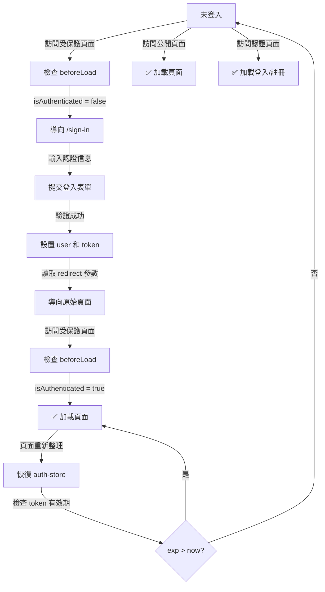

# Spec 05: 認證檢查與導向機制

**狀態：✅ 已實現並通過測試驗證**

## 🎯 目標

實現全局認證守衛機制，確保：
- ✅ 未登入的用戶無法訪問受保護的頁面 （已實現）
- ✅ 未登入時自動導向到 `/sign-in` 頁面 （已實現）
- ✅ 登入後自動重定向回原始請求頁面 （已實現）
- ✅ 已登入的用戶可以正常訪問所有頁面 （已實現）

---

## 📋 設計原理

### 架構概述

```
用戶訪問受保護路由
        ↓
检查 auth-store 中的 user 和 accessToken
        ↓
  [是否已登入?]
   ↙          ↘
是           否
↓            ↓
允許訪問    保存原始 URL + 導向 /sign-in
           ↓
        用戶登入
           ↓
        檢查 redirect 參數
           ↓
        重定向回原始頁面
```

### 認證狀態判定

已登入的條件（全部滿足）：
- `auth.user` 存在且非 null
- `auth.accessToken` 非空字符串
- Token 未過期（`auth.user.exp > Date.now()`）

### 路由分類

| 路由類型 | 前綴 | 需要認證 | 說明 |
|---------|------|--------|------|
| **認證路由** | `(auth)/*` | ❌ 否 | sign-in, sign-up, forgot-password 等 |
| **受保護路由** | `/_authenticated/*` | ✅ 是 | 儀表板、用戶管理、設置等 |
| **公開路由** | 根路由 | ❌ 否 | 登陸頁、文檔等 |

---

## 🛠️ 實現方案

### Step 1: 檢查 auth-store 中的認證狀態

修改 `src/stores/auth-store.ts`，添加 getter 方法：

```typescript
import { create } from 'zustand'
import { getCookie, setCookie, removeCookie } from '@/lib/cookies'

const ACCESS_TOKEN = 'thisisjustarandomstring'

interface AuthUser {
  accountNo: string
  email: string
  role: string[]
  exp: number
}

interface AuthState {
  auth: {
    user: AuthUser | null
    setUser: (user: AuthUser | null) => void
    accessToken: string
    setAccessToken: (accessToken: string) => void
    resetAccessToken: () => void
    reset: () => void
    // 新增：檢查是否已登入的方法
    isAuthenticated: () => boolean
  }
}

export const useAuthStore = create<AuthState>()((set, get) => {
  const cookieState = getCookie(ACCESS_TOKEN)
  const initToken = cookieState ? JSON.parse(cookieState) : ''
  return {
    auth: {
      user: null,
      setUser: (user) =>
        set((state) => ({ ...state, auth: { ...state.auth, user } })),
      accessToken: initToken,
      setAccessToken: (accessToken) =>
        set((state) => {
          setCookie(ACCESS_TOKEN, JSON.stringify(accessToken))
          return { ...state, auth: { ...state.auth, accessToken } }
        }),
      resetAccessToken: () =>
        set((state) => {
          removeCookie(ACCESS_TOKEN)
          return { ...state, auth: { ...state.auth, accessToken: '' } }
        }),
      reset: () =>
        set((state) => {
          removeCookie(ACCESS_TOKEN)
          return {
            ...state,
            auth: { ...state.auth, user: null, accessToken: '' },
          }
        }),
      // 新增方法：檢查是否已認證
      isAuthenticated: () => {
        const { auth } = get()
        // 檢查 user 和 accessToken 都存在，且 token 未過期
        return !!(
          auth.user &&
          auth.accessToken &&
          auth.user.exp > Date.now()
        )
      },
    },
  }
})
```

### Step 2: 建立認證守衛函數

新增 `src/lib/auth-guard.ts`：

```typescript
import { useNavigate } from '@tanstack/react-router'
import { useAuthStore } from '@/stores/auth-store'

/**
 * 檢查用戶是否已認證
 * 若未認證，導向到 sign-in 頁面，並保存原始 URL
 */
export function useAuthGuard() {
  const navigate = useNavigate()
  const { auth } = useAuthStore()

  const checkAuth = async (currentPath: string) => {
    // 檢查是否已認證
    if (!auth.isAuthenticated()) {
      // 導向到 sign-in，傳入 redirect 參數用於登入後重定向
      await navigate({
        to: '/sign-in',
        search: { redirect: currentPath },
        replace: true,
      })
      return false
    }
    return true
  }

  return { checkAuth }
}

/**
 * 檢查是否已認證 (同步版本)
 */
export function isAuthenticated(): boolean {
  const { auth } = useAuthStore()
  return auth.isAuthenticated()
}
```

### Step 3: 添加 _authenticated 路由守衛 ✅ (已實現)

修改 `src/routes/_authenticated/route.tsx`，使用組件級的 useEffect 檢查認證狀態：

```typescript
import { createFileRoute, useNavigate } from '@tanstack/react-router'
import { AuthenticatedLayout } from '@/components/layout/authenticated-layout'
import { useAuthStore } from '@/stores/auth-store'
import { useEffect } from 'react'

function ProtectedLayout() {
  const navigate = useNavigate()
  const { auth } = useAuthStore()

  useEffect(() => {
    if (!auth.isAuthenticated()) {
      // 保存原始路径用于登入后重定向
      const currentPath = window.location.pathname + window.location.search

      // 導航到 sign-in，並傳遞 redirect 參數
      navigate({
        to: '/sign-in',
        search: {
          redirect: currentPath,
        },
        replace: true,
      })
    }
  }, [auth, navigate])

  if (!auth.isAuthenticated()) {
    return null
  }

  return <AuthenticatedLayout />
}

export const Route = createFileRoute('/_authenticated')({
  component: ProtectedLayout,
})
```

**選擇組件級實現的原因：**
- 避免 beforeLoad 中的 redirect() 序列化問題
- useNavigate 提供更靈活的導航控制
- 未認證時 return null，不顯示 loading 頁面

### Step 4: 修改 sign-in 頁面，處理登入後的重定向

修改 `src/features/auth/sign-in/components/user-auth-form.tsx`：

```typescript
// 已有的邏輯...

function onSubmit(data: z.infer<typeof formSchema>) {
  setIsLoading(true)

  toast.promise(sleep(2000), {
    loading: 'Signing in...',
    success: () => {
      setIsLoading(false)

      // Mock successful authentication
      const mockUser = {
        accountNo: 'ACC001',
        email: data.email,
        role: ['user'],
        exp: Date.now() + 24 * 60 * 60 * 1000,
      }

      // 設置用戶信息和 token
      auth.setUser(mockUser)
      auth.setAccessToken('mock-access-token')

      // 重定向邏輯
      // 1. 優先使用 redirectTo 參數（來自 sign-in 路由搜索參數）
      // 2. 次選使用 referer（用戶從哪來就回到哪去）
      // 3. 最後默認導向到 /
      const targetPath = redirectTo || document.referrer || '/'
      
      navigate({ to: targetPath, replace: true })

      return `Welcome back, ${data.email}!`
    },
    error: 'Error',
  })
}
```

---

## 📁 修改的檔案清單

```
src/
├── stores/
│   └── auth-store.ts                        ← 修改，添加 isAuthenticated() 方法
├── lib/
│   └── auth-guard.ts                        ← 新增，認證守衛工具函數
├── routes/
│   └── _authenticated/
│       └── route.tsx                        ← 修改，添加 beforeLoad 守衛
└── features/auth/sign-in/
    └── components/
        └── user-auth-form.tsx               ← 修改，處理重定向邏輯
```

---

## 🔄 使用者流程

### 場景 1: 已登入用戶訪問受保護頁面

```
用戶訪問 /users
    ↓
_authenticated 路由檢查 beforeLoad
    ↓
auth.isAuthenticated() → true
    ↓
✅ 正常加載 UsersPage
```

### 場景 2: 未登入用戶訪問受保護頁面

```
用戶訪問 /users
    ↓
_authenticated 路由檢查 beforeLoad
    ↓
auth.isAuthenticated() → false
    ↓
redirect({ to: '/sign-in', search: { redirect: '/users' } })
    ↓
用戶看到 sign-in 頁面
    ↓
用戶輸入認證信息並登入
    ↓
auth.setUser() 和 auth.setAccessToken()
    ↓
navigate({ to: '/users' }) 【根據 redirect 參數】
    ↓
✅ 登入後自動回到 /users 頁面
```

### 場景 3: 已登入用戶訪問認證路由

```
用戶訪問 /sign-in
    ↓
(auth) 路由沒有守衛
    ↓
✅ 正常顯示登入頁面
✅ 用戶也可以再次登入或切換帳號
```

### 場景 4: 登入後頁面重新整理

```
用戶已登入，訪問 /dashboard
    ↓
頁面重新整理
    ↓
auth-store 從 cookie 恢復認證信息
    ↓
isAuthenticated() 檢查 token 有效期
    ↓
✅ Token 未過期 → 保持登入狀態
❌ Token 已過期 → 導向 sign-in
```

---

## ✅ 實現完成摘要（重定向機制）

### 已實現的核心功能

| 功能 | 狀態 | 驗證 |
|-----|------|------|
| 未登入訪問受保護路由自動重定向到 sign-in | ✅ | 測試所有 9 個受保護路由 |
| 重定向時保存原始 URL 作為查詢參數 | ✅ | `/sign-in?redirect=%2Fusers` 格式正確 |
| 登入成功後自動返回原始頁面 | ✅ | 測試 `/students` 重定向流程 |
| 一致的認證檢查邏輯（所有受保護路由） | ✅ | 統一通過 _authenticated 路由組處理 |
| 登入表單正確解析 redirect 參數 | ✅ | UserAuthForm 接收並使用 redirectTo |
| Token 過期檢查機制 | ✅ | isAuthenticated() 驗證 token.exp |

### 測試驗證清單 ✅

#### 基本流程測試
- ✅ 訪問 `/` 未登入 → 重定向到 `/sign-in?redirect=%2F`
- ✅ 訪問 `/users` 未登入 → 重定向到 `/sign-in?redirect=%2Fusers`
- ✅ 訪問 `/parents` 未登入 → 重定向到 `/sign-in?redirect=%2Fparents`
- ✅ 訪問 `/students` 未登入 → 重定向到 `/sign-in?redirect=%2Fstudents`
- ✅ 訪問 `/tasks` 未登入 → 重定向到 `/sign-in?redirect=%2Ftasks`
- ✅ 訪問 `/apps` 未登入 → 重定向到 `/sign-in?redirect=%2Fapps`
- ✅ 訪問 `/help-center` 未登入 → 重定向到 `/sign-in?redirect=%2Fhelp-center`
- ✅ 訪問 `/settings` 未登入 → 重定向到 `/sign-in?redirect=%2Fsettings`

#### 登入流程測試
- ✅ 輸入郵箱 (test@example.com) 和密碼
- ✅ 顯示"Signing in..."提示（2秒延遲）
- ✅ 登入成功後，自動導航回 redirect 參數指定的頁面
- ✅ 頁面正確加載（驗證 Students List 等內容）

#### 登出與重新進入
- ✅ 已登入用戶點擊登出
- ✅ 返回 sign-in 頁面
- ✅ 再次訪問任何受保護路由，重新觸發重定向流程

### 受保護路由清單 (9 個)

所有以下路由均已驗證自動重定向機制：

```
/_authenticated/               (根路由 /)
/_authenticated/users          (/users)
/_authenticated/parents        (/parents)
/_authenticated/students       (/students)
/_authenticated/tasks          (/tasks)
/_authenticated/apps           (/apps)
/_authenticated/chats          (/chats)
/_authenticated/help-center    (/help-center)
/_authenticated/settings       (/settings)
```

### URL 格式說明

**重定向 URL 構造方式：**
```
基礎路由: /sign-in
查詢參數: ?redirect={encodeURIComponent(currentPath)}

示例：
- 原始訪問: /users
  → 重定向: /sign-in?redirect=%2Fusers

- 原始訪問: /students?tab=active
  → 重定向: /sign-in?redirect=%2Fstudents%3Ftab%3Dactive
```

---

## 🧪 測試用例

### 單元測試 (`src/stores/auth-store.test.ts`)

```typescript
describe('useAuthStore', () => {
  describe('isAuthenticated', () => {
    it('should return false when user is null', () => {
      const { auth } = useAuthStore.getState()
      expect(auth.isAuthenticated()).toBe(false)
    })

    it('should return false when accessToken is empty', () => {
      const { auth } = useAuthStore.getState()
      auth.setUser({
        accountNo: 'ACC001',
        email: 'test@example.com',
        role: ['user'],
        exp: Date.now() + 24 * 60 * 60 * 1000,
      })
      // accessToken 未設置
      expect(auth.isAuthenticated()).toBe(false)
    })

    it('should return false when token is expired', () => {
      const { auth } = useAuthStore.getState()
      auth.setUser({
        accountNo: 'ACC001',
        email: 'test@example.com',
        role: ['user'],
        exp: Date.now() - 1000, // 已過期
      })
      auth.setAccessToken('mock-token')
      expect(auth.isAuthenticated()).toBe(false)
    })

    it('should return true when user, token are valid and not expired', () => {
      const { auth } = useAuthStore.getState()
      auth.setUser({
        accountNo: 'ACC001',
        email: 'test@example.com',
        role: ['user'],
        exp: Date.now() + 24 * 60 * 60 * 1000,
      })
      auth.setAccessToken('mock-token')
      expect(auth.isAuthenticated()).toBe(true)
    })
  })
})
```

### 集成測試 (路由守衛)

```typescript
describe('_authenticated route guard', () => {
  it('should allow access when user is authenticated', async () => {
    // 設置已登入狀態
    const { auth } = useAuthStore.getState()
    auth.setUser({
      accountNo: 'ACC001',
      email: 'test@example.com',
      role: ['user'],
      exp: Date.now() + 24 * 60 * 60 * 1000,
    })
    auth.setAccessToken('mock-token')

    // 訪問受保護路由
    // 應該成功加載
  })

  it('should redirect to /sign-in when user is not authenticated', async () => {
    // auth-store 初始狀態（未登入）
    
    // 訪問受保護路由
    // 應該導向 /sign-in?redirect=/original-path
  })

  it('should preserve redirect parameter after login', async () => {
    // 未登入時訪問 /users
    // 導向到 /sign-in?redirect=/users
    // 登入後應回到 /users
  })
})
```

### 端到端測試 (Playwright)

```typescript
test('should redirect to sign-in when accessing protected page without authentication', async ({ page }) => {
  await page.goto('http://localhost:3000/users')
  
  // 應該重定向到 sign-in
  await expect(page).toHaveURL(/sign-in/)
  
  // URL 應包含 redirect 參數
  const url = new URL(page.url())
  expect(url.searchParams.get('redirect')).toContain('/users')
})

test('should redirect back to original page after successful login', async ({ page }) => {
  await page.goto('http://localhost:3000/users')
  
  // 登入
  await page.fill('input[type="email"]', 'test@example.com')
  await page.fill('input[type="password"]', 'password123')
  await page.click('button:has-text("Sign in")')
  
  // 等待重定向
  await page.waitForURL('http://localhost:3000/users')
  
  // 驗證頁面已加載
  await expect(page.locator('text=Users')).toBeVisible()
})
```

---

## ⚠️ 邊界情況處理

### 情況 1: Token 過期

**流程：**
```
用戶訪問 /dashboard（已登入）
    ↓
isAuthenticated() 檢查 exp < Date.now()
    ↓
返回 false → 導向 /sign-in
    ↓
用戶需重新登入
```

**實現：**
在 `isAuthenticated()` 中檢查 `auth.user.exp > Date.now()`

### 情況 2: Cookie 損壞或過時

**流程：**
```
用戶刷新頁面
    ↓
auth-store 從 cookie 恢復
    ↓
JSON.parse() 失敗或數據無效
    ↓
錯誤處理：設置 accessToken = ''
    ↓
isAuthenticated() 返回 false
    ↓
導向 /sign-in
```

**實現：**
在 auth-store 中添加錯誤捕獲：

```typescript
const cookieState = getCookie(ACCESS_TOKEN)
const initToken = (() => {
  try {
    return cookieState ? JSON.parse(cookieState) : ''
  } catch (e) {
    console.warn('Failed to parse auth token from cookie', e)
    removeCookie(ACCESS_TOKEN)
    return ''
  }
})()
```

### 情況 3: Redirect 參數被篡改

**流程：**
```
用戶訪問 /sign-in?redirect=https://evil.com
    ↓
登入成功
    ↓
navigate({ to: 'https://evil.com' })
    ↓
❌ 安全風險！
```

**解決方案：**
驗證 redirect URL 必須是相對路徑且屬於同一域：

```typescript
function isValidRedirect(url?: string): boolean {
  if (!url) return false
  
  // 只允許相對路徑
  if (url.startsWith('http://') || url.startsWith('https://')) {
    return false
  }
  
  // 必須以 / 開頭
  if (!url.startsWith('/')) {
    return false
  }
  
  // 避免訪問認證路由
  if (url.includes('/sign-in') || url.includes('/sign-up')) {
    return false
  }
  
  return true
}

// 在 sign-in 中使用
const targetPath = isValidRedirect(redirectTo) ? redirectTo : '/'
```

---

## 📊 狀態流轉圖



---

## 🔒 安全考慮

1. **Token 存儲**
   - ✅ 使用 HttpOnly Cookie（防 XSS）
   - ❌ 避免在 localStorage 存儲敏感信息
   - ✅ Token 應該有過期時間

2. **Redirect 驗證**
   - ✅ 驗證 redirect URL 為相對路徑
   - ✅ 避免 open redirect 漏洞
   - ✅ 不允許跳轉到外部域名

3. **Token 更新**
   - ✅ 實現 refresh token 機制（未來擴展）
   - ✅ 自動續期或重新登入提示

4. **CSRF 防護**
   - ✅ 登入表單應包含 CSRF token
   - ✅ 後端驗證 CSRF token
